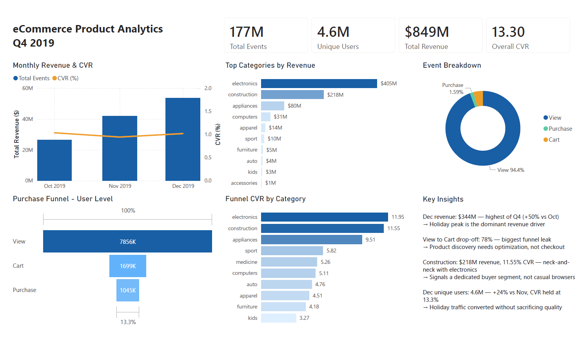
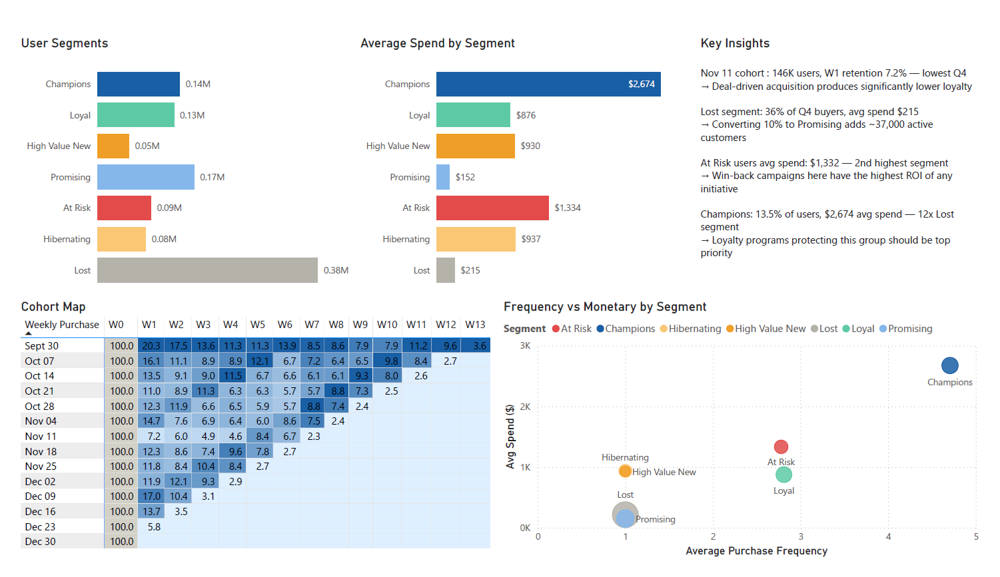

# eCommerce Product Analytics — Q4 2019

Product analytics project analyzing 177M behavioral events from a multi-category eCommerce store across Q4 2019 (Oct–Dec). Built on BigQuery with a Power BI dashboard covering funnel analysis, cohort retention, RFM segmentation, and product performance.

---

## Dashboard Preview




---

## Project Overview

| Item | Detail |
|---|---|
| Dataset | Rees46 eCommerce Behavior Data (Kaggle) |
| Period | October – December 2019 (Q4) |
| Total rows | 177,493,621 events |
| Tools | BigQuery · SQL · Power BI |
| Connection | Power BI Import mode |
| Analyses | Funnel · Cohort Retention · RFM · Product Performance |

---

## Key Findings

**Overview**
- December drove $344M revenue — highest of Q4 (+50% vs Oct), confirming the holiday peak as the dominant revenue driver
- Despite 4.6M unique users in December (+24% vs November), CVR held stable at 13.3% — platform scaled to holiday demand without diluting conversion quality

**Funnel**
- View-to-cart drop-off of 78% is the primary conversion bottleneck — significantly outweighing cart abandonment at 38%, suggesting product discovery needs more attention than the checkout flow
- Construction emerged as an unexpected #2 category by both revenue ($218M) and CVR (11.55%), neck-and-neck with electronics — signals a dedicated high-intent buyer segment

**Cohort Retention**
- November 11th cohort brought 146K new buyers — nearly double any other week — yet recorded the lowest Week 1 retention at 7.2%, consistent with deal-driven acquisition producing lower long-term loyalty
- October cohorts show a retention bump at weeks 5–6, coinciding with Black Friday — promotional events successfully reactivated lapsed buyers from previous months

**RFM Segmentation**
- At Risk segment carries $1,332 average spend — 2nd highest of all segments — representing the highest win-back ROI opportunity in the user base
- 36% of Q4 buyers classified as Lost — one-time holiday purchasers — converting 10% to Promising would add ~37,000 active customers
- Champions represent only 13.5% of users but average $2,674 spend — 12x the Lost segment average of $215

---

## Architecture

```
Data Source
  Rees46 eCommerce Behavior Data (Kaggle)
  Oct 2019: 42,448,764 rows
  Nov 2019: 67,501,979 rows
  Dec 2019: 67,542,878 rows
  Total:   177,493,621 rows

Storage Layer
  Google Cloud Storage bucket
  CSV files uploaded via GCS console

BigQuery — raw_events table
  Partitioned by MONTH on event_time
  Clustered by event_type
  Explicit JSON schema (production best practice)
  STRING type for all ID columns (user_id, product_id, category_id)
  REQUIRED mode on event_time and event_type

Transformation Layer
  vw_clean_events
    ROW_NUMBER() deduplication — removed duplicate cart events
    category_top extracted from hierarchical category_code
    Brand normalized to lowercase
    price_bucket segmentation
    Time dimensions extracted (event_date, event_month, event_hour)

Analytical Views
  vw_funnel   — Q4 overall funnel + monthly trend + category CVR
  vw_cohort   — 13-week pivoted retention matrix
  vw_rfm      — 7-segment RFM with binary frequency scoring
  vw_product  — category, brand and price performance metrics
  vw_overview — KPIs, month-over-month deltas, event breakdown

Dashboard
  Power BI Desktop — Import mode
  Page 1: Overview & Funnel
  Page 2: Retention & Products
```

---

## SQL Files

| File | Description |
|---|---|
| `sql/01_schema.json` | BigQuery table schema with explicit types and modes |
| `sql/02_eda.sql` | Exploratory analysis — nulls, duplicates, distributions, category structure |
| `sql/03_cleaning.sql` | vw_clean_events — deduplication, enrichment, category parsing |
| `sql/04_funnel.sql` | vw_funnel — user-level funnel with category CVR breakdown |
| `sql/05_cohort.sql` | vw_cohort — weekly cohort retention matrix (W0–W13) |
| `sql/06_rfm.sql` | vw_rfm — RFM scoring and 7-segment classification |
| `sql/07_product.sql` | vw_product — revenue, CVR and AOV by category, brand and price bucket |
| `sql/08_overview.sql` | vw_overview — KPIs, MoM deltas and event type breakdown |

---

## Data Quality Findings

Two significant data quality issues were identified during EDA and resolved before analysis:

**1. Duplicate cart events**

Cart events contained up to 78 identical rows at the exact same timestamp for the same user, session and product. This was confirmed as a frontend tracking bug rather than quantity data — the dataset has no quantity column and the timestamps were identical to the millisecond, which is physically impossible for genuine user clicks. Resolved via ROW_NUMBER() deduplication in vw_clean_events, keeping one row per unique combination of event_time, event_type, user_id, user_session and product_id.

**2. Category code nulls**

32% of rows had a null category_code value. Rather than dropping these rows and losing a third of the dataset, nulls were preserved as 'unknown' — maintaining full event volume while being transparent about the data gap. These rows are explicitly filtered out of category-level analyses in vw_product and vw_funnel.

---

## Design Decisions

**Funnel — user-level not event-level**

The funnel counts distinct users at each stage rather than events. A user who views 10 products contributes 1 to the viewer count, not 10. This is the industry standard approach to produce produce meaningful conversion rates.

**RFM — binary frequency scoring**

Standard RFM uses NTILE(5) for frequency scoring. In this dataset 80% of users purchased exactly once in Q4, making NTILE frequency buckets meaningless — scores 1 through 4 all mapped to frequency = 1. Frequency was redesigned as binary: score 5 for repeat buyers (2+ purchase days) and score 1 for one-time buyers. This honestly reflects Q4 eCommerce behavior where holiday acquisition dominates and repeat purchase rates are naturally low within a single quarter.

**Cohort — weekly not monthly**

With only 3 months of data, monthly cohorts would produce just 2–3 retention data points. Weekly cohorts across Q4 produce 13 cohort groups with up to 13 retention data points each — a significantly richer matrix that reveals meaningful patterns including the Singles Day anomaly and the Black Friday reactivation effect.

**BigQuery — materialized views not used**

Materialized views were evaluated for the dashboard layer but BigQuery materialized views do not support COUNT DISTINCT — which is fundamental to user-level funnel and cohort analysis. Since the dataset is a static historical snapshot imported once into Power BI, regular views scanned once at import cost under $0.40 total, making materialized views unnecessary for this use case.

---

## Schema

```json
[
  {"name": "event_time",    "type": "TIMESTAMP", "mode": "REQUIRED"},
  {"name": "event_type",    "type": "STRING",    "mode": "REQUIRED"},
  {"name": "product_id",    "type": "STRING",    "mode": "NULLABLE"},
  {"name": "category_id",   "type": "STRING",    "mode": "NULLABLE"},
  {"name": "category_code", "type": "STRING",    "mode": "NULLABLE"},
  {"name": "brand",         "type": "STRING",    "mode": "NULLABLE"},
  {"name": "price",         "type": "FLOAT",     "mode": "NULLABLE"},
  {"name": "user_id",       "type": "STRING",    "mode": "NULLABLE"},
  {"name": "user_session",  "type": "STRING",    "mode": "NULLABLE"}
]
```

ID columns (user_id, product_id, category_id) are typed as STRING rather than INTEGER — identifiers are never used in arithmetic operations and STRING prevents precision loss for very large numeric IDs. event_time and event_type are REQUIRED mode, rejecting any row missing these critical fields at load time.

---

## Dataset

[Rees46 eCommerce Behavior Data — Multi Category Store](https://www.kaggle.com/datasets/mkechinov/ecommerce-behavior-data-from-multi-category-store)

Real behavioral event data from a large multi-category eCommerce platform, provided by Rees46 — a recommendation and analytics platform. The dataset contains view, cart and purchase events with product metadata including category, brand and price.

---

## Author

Mert Dal
